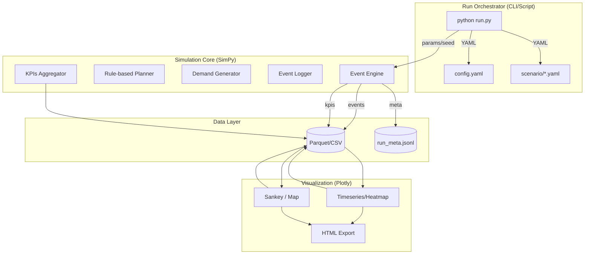
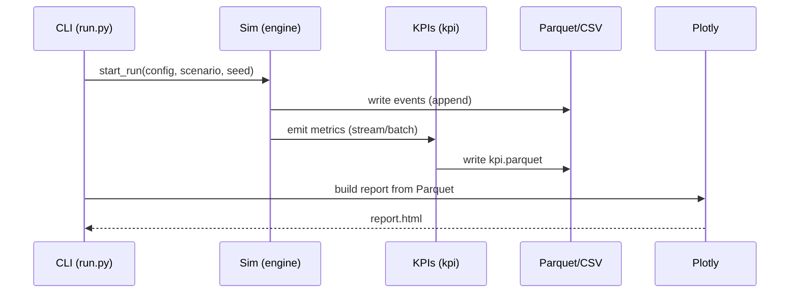

# 豊洲QX ターレ運用シミュレーション — Python最小構成

## 0. 方針
- **技術スタックを Python に統一**（当面はシミュレーションと可視化のみ）。
- **コア領域に集中**: SimPy で DES、Plotly で可視化。I/O は Parquet/CSV。
- **将来**: marimo でインタラクティブ分析を追加（Phase 1後）。

## 1. 構成要素（論理）

- **Runner**: 1回の Run を開始/停止、シード・シナリオ適用。
- **Sim**: 1秒粒度イベント処理、積込/到着/荷下ろし等のイベント生成。
- **Planner**: ルールベース割当（近傍空車・出発トリガ）。
- **Demand**: 時間帯強度に基づく注文（S/M/L）生成。
- **Logger/KPIs**: イベント→Parquet、集計→Parquet。
- **Viz**: Plotly で静的 HTML レポートを出力。

## 2. ディレクトリ
```
repo/
  run.py                  # 入口（引数: --scenario, --seed, --config）
  sim/
    engine.py             # SimPy イベントループ/資源
    planner_rule.py       # ルールベース
    demand.py             # 需要生成
    kpi.py                # KPI 集計
    models.py             # Dataclass: Tare, Order, Node ...
  config/
    config.yaml           # α/β, 速度, 出発トリガ, 混載ポリシー
    scenario/default.yaml # 需要曲線, 仲卸/小売規模, 稼働ウィンドウ
  data/
    runs/                 # run_id/ 以下に成果物
      {run_id}/events.parquet
      {run_id}/kpi.parquet
      {run_id}/meta.jsonl
      {run_id}/report.html
  notebooks/
    analysis_marimo.py    # Phase 2: marimo UI（将来）
```

## 3. ランタイム・シーケンス（最小）


## 4. I/O スキーマ（要約）
| ファイル | 主な列 | 備考 |
|---|---|---|
| `events.parquet` | ts, run_id, tare_id, node, event, state, load_w, payload | 秒粒度/イベント駆動 |
| `kpi.parquet` | run_id, metric, value, window, ts | 稼働率・距離・LT 等 |
| `meta.jsonl` | run_id, cmdline, config_hash, started_at, ended_at | 再現性・監査 |
| `report.html` | Plotly グラフ | 共有用静的レポート |

## 5. 設定（例）`config.yaml`
```yaml
speed_kmph: 8.0
alpha_load: 0.3    # s/kg
beta_load: 10.0    # s
trade_proc_sec: 30
capacity_kg: 200
depart_trigger:
  min_stay_sec: 300   # 5分ルール
  min_load_ratio: 0.5 # 例: 50%で出発可
consolidation: same_destination_only
window: "04:00-12:00"
```

## 6. marimo 連携（将来）
- `analysis_marimo.py` で Parquet を読み込み、スライダで α/β、出発トリガ、需要倍率を変更し、KPIs を再計算。
- 将来、Planner を差し替え可能（OR-Tools/量子）だが、API化は不要（同一プロセス内で呼び出す）。

## 7. 実行例
```bash
python run.py --scenario config/scenario/default.yaml --config config/config.yaml --seed 42
# -> data/runs/2025-11-11_1200Z/
#    events.parquet, kpi.parquet, meta.jsonl, report.html
```

## 8. 非ゴール（当面スコープ外）
- Web API / 認証 / RBAC
- 分散実行・オートスケール
- DB 常時稼働（pg/redis）。必要になれば追加